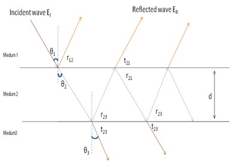
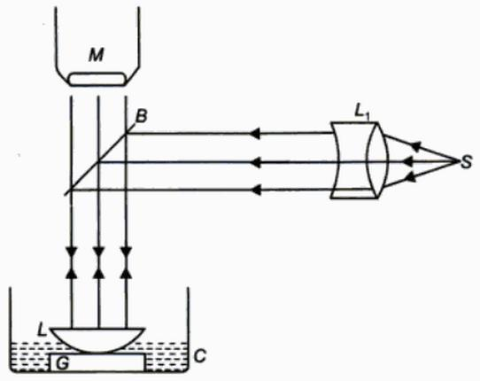

### Theory 

<iframe width="560" height="315" src="https://www.youtube.com/embed/PU-SeNfIRcs" frameborder="0" allow="autoplay; encrypted-media" allowfullscreen></iframe>

### Thin film interference

A film is said to be thin when its thickness is about the order of one wavelength of visible light which is taken to be 550 nm.  When light is incident on such a film, a small portion gets reflected from the upper surface and a major portion is transmitted into the film. Again a small part of the transmitted component is reflected back into the film by the lower surface and the rest of it emerges out of the film. These reflected beams reunite to produce interference.  Also the transmitted beams too interfere.  This type of interference that takes place in thin films is called interference by division of amplitude.

  

 

$Θ_{1}$    angle of incidence at medium 1 to medium 2 boundary. 
$Θ_{2}$    angle of refraction at medium 1 to medium 2 boundary. 
$Θ_{3}$    angle of refraction at medium 2 to medium 3 boundary. 
$r_{12}$    reflected light from medium 1 to medium 2 boundary. 
$r_{23}$    reflected light from medium 2 to medium 1 boundary. 
$r_{21}$    reflected light from medium 2 to medium 3 boundary. 
$t_{21}$    transmitted light from medium 2 to medium 1 boundary. 
$t_{23}$    transmitted light from medium 2 to medium 3 boundary. 
$d$       thickness of the film. 

&nbsp;&nbsp;&nbsp;In the above figure the rays r12 and t21 interfere and results in a constructive or destructive interference depending on their path differences, given as,

**constructive interferenc**
$$2\mu_{2}d\space\cos (r_{12})=(2m+1)\frac{\lambda}{2}$$

**destructive interference**
$$2\mu_{2}d\space\cos (r_{12})=m\lambda$$

Where, $\mu_{2}$: refractive index of the  medium 2 and $m=0,1,2,...$ the order of interference. 

The transmitted light from $t_{23}$ can also interfere and result in constructive or destructive interference.

### To find the refractive index of liquid
The experiment is performed when there is an air film between the plano-convex lens and the optically plane glass plate.The diametre of the mth and the (m+p)th dark rings are determined with the help of a travelling microscope.

For air
$$D^{2}_{m+p}=4(m+p)\lambda R$$

$$D^{2}_{m}=4m\lambda R$$

$$D^{2}_{m+p}-D^{2}_{m}=4p\lambda R$$

As shown in figure arrange the lens with glass plate. Pour one or two drops of liquid whose refractive index is to be determined without disturbing the arrangement. Now the air film between the lens and glass plate is replaced by the liquid. The diameters of m+pth and mth rings are determined.

 For liquids,

  

 

$2\mu t\cos r= m\lambda$ , for dark rings

For normal incidence $\cos r=1$ , so

$$2\mu t=m\lambda$$

But $t=\frac{r^{2}}{2R}$ , $r=\frac{D}{2}$

 Rearranging the above equation ,we get
$$D_{_{m}}^{^{2}}=\frac{4m\lambda R}{\mu }$$

We have $D_{m+p}^{2}-D_{m}^{2}=4p\lambda R$

for liquids, 
$$D_{m+p}^{'2}-D_{m}^{'2}=\frac{4p\lambda R}{\mu }$$
From these two euations the refractive index of the given liquids is given by

$$\mu=\frac{D_{m+p}^{2}-D_{m}^{2}}{D_{m+p}^{'2}-D_{m}^{'2}}$$

 
